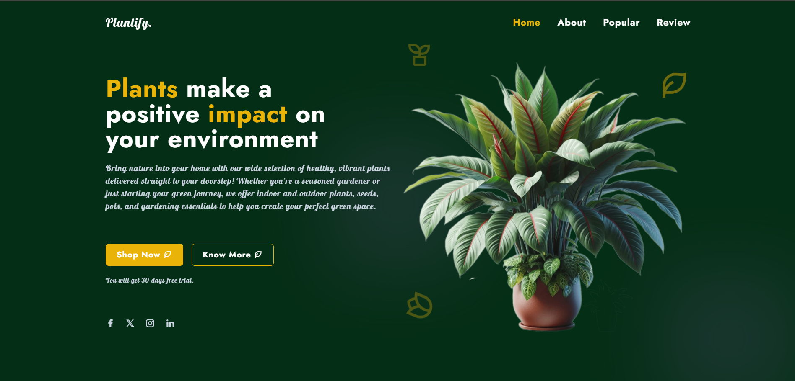
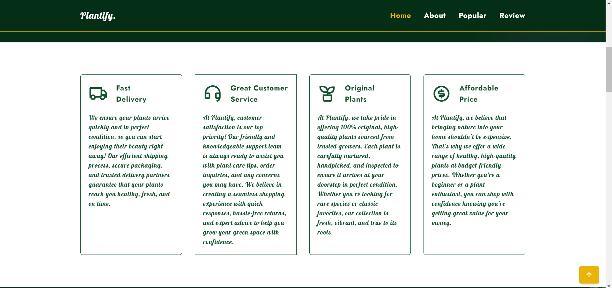
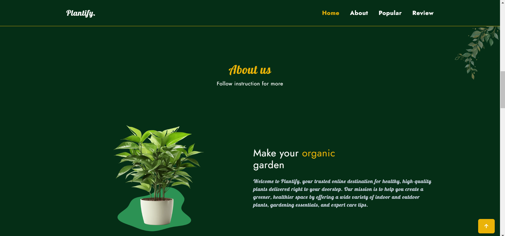
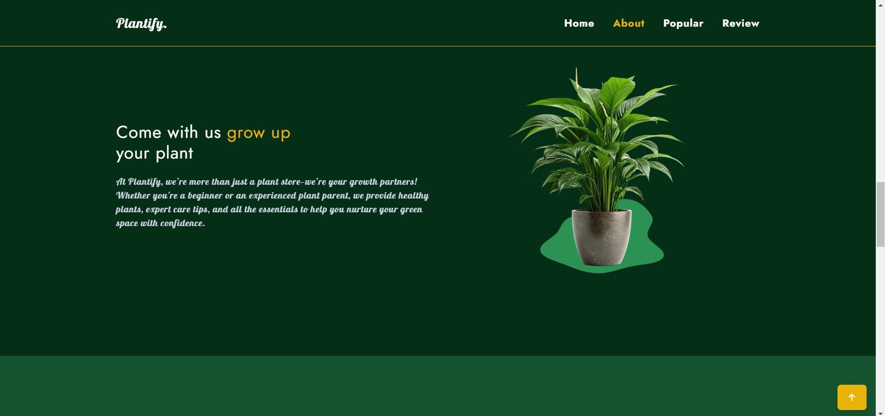
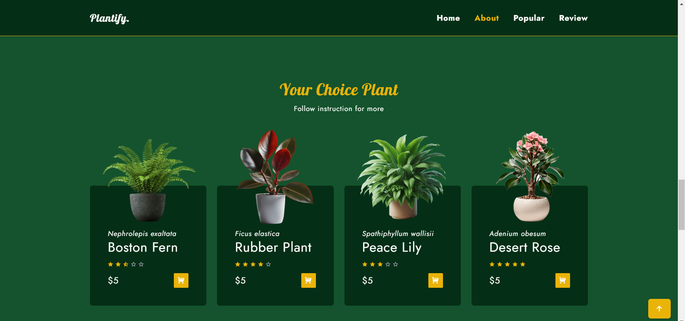
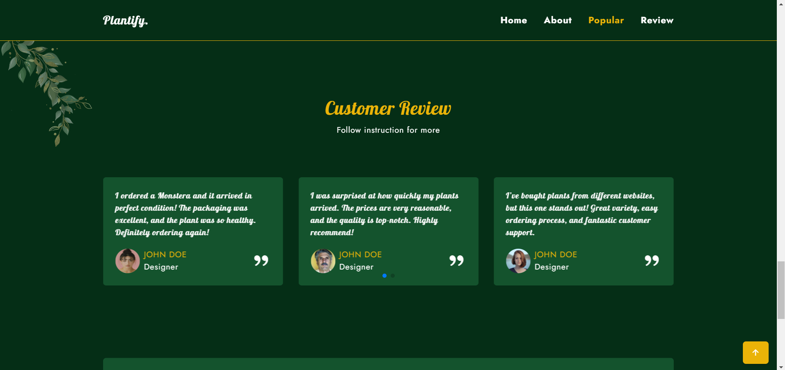

# Plant Website Landing Page

A modern and visually appealing Plant website landing page built with **Tailwind CSS**. This project showcases a responsive design with smooth animations and a delightful user experience.

## 📸 Screenshot
Here’s a preview of the website:


<br/>

<br/>

<br/>

<br/>

<br/>

<br/>


## 📌 Features
- 🍦 Fully responsive design
- 🎨 Beautiful UI with Tailwind CSS
- 📱 Mobile-friendly layout

## 🛠️ Technologies Used
- **HTML5**
- **Tailwind CSS**
- **JavaScript**
- **NPM** for package management

## 📦 Installation

To set up and run this project locally, follow these steps:

1. **Clone the repository**
   ```sh
   git clone https://github.com/dhiraj-1104/plantify-plant-website.git
   cd plantify-plant-website
   ```

2. **Install dependencies**
   ```sh
   npm install
   ```

3. **Start the development server**
   ```sh
   npm run start
   ```

---

👨‍💻 **Developed by [DHIRAJ CHAVAN](https://github.com/dhiaj-1104)**

Happy coding! 🎉🍦

